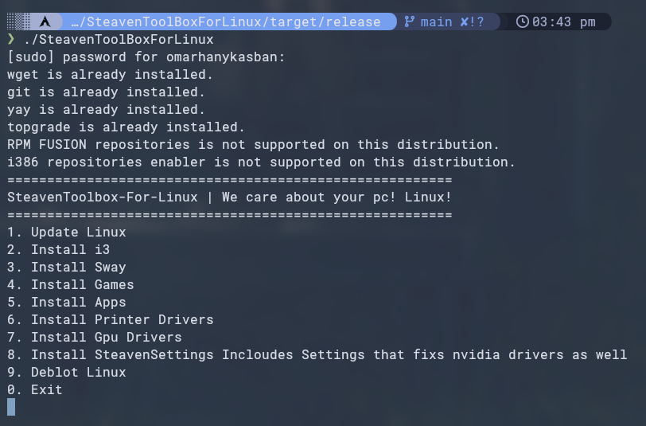

# SteavenToolBoxForLinux
A Free Open Source Toolbox For Debian and Ubuntu and Fedora and Arch!

> **Readme**

Launch Command:

`bash <(wget -qO- raw.githubusercontent.com/SteavenToolBox/Linux/main/start.sh)`